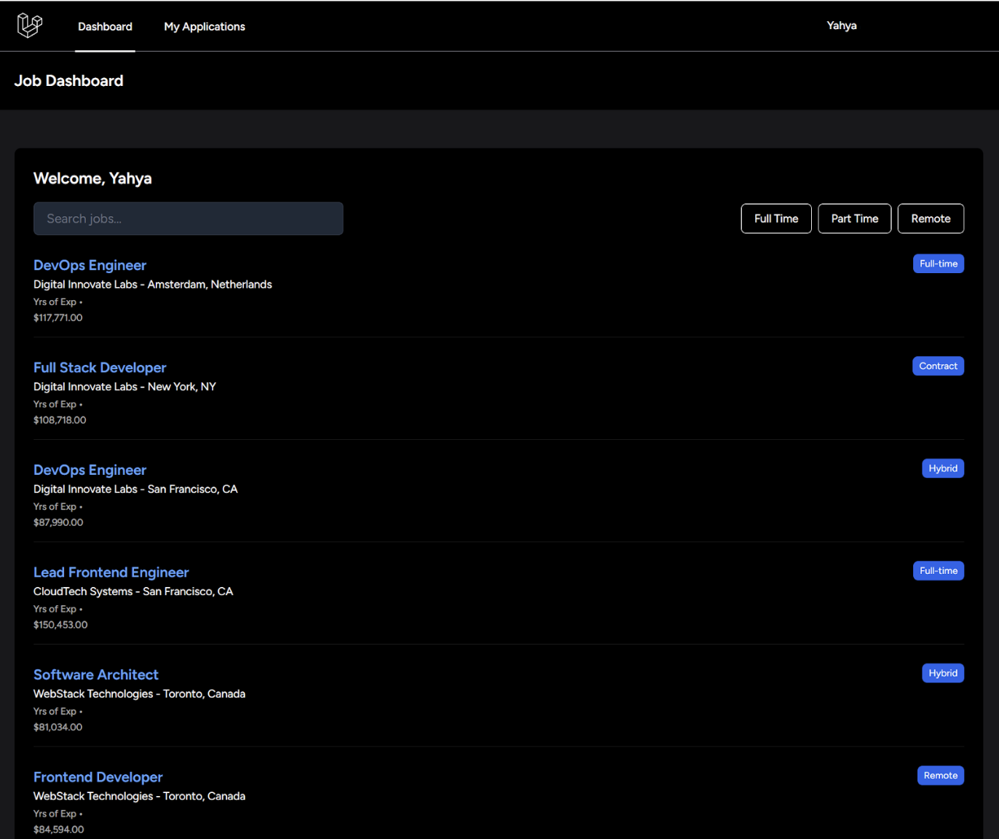
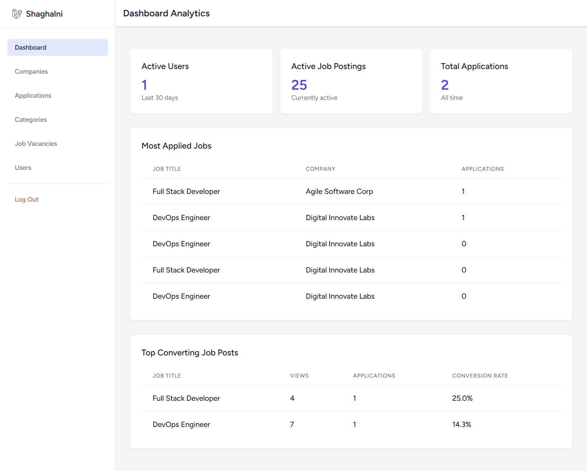

# Jobify

## Table of Contents
- [Description](#description)
- [Motivation](#motivation)
- [Quick Start](#-quick-start)
- [Technologies Used](#technologies-used)
  - [Backend](#backend)
  - [Frontend](#frontend)

## Description
A Job Board platform serving job seekers and company managers. It features the integration of artificial intelligence (ChatGPT) for automated application evaluation and intelligent compatibility reports.
### User Side

### Dashboard



## Motivation
Introducing a solution that integrates AI with job applications. Instead of reading dozens of job descriptions, sometimes with misleading job titles, AI will handle the task of evaluating your resume for the job, determining whether it's a suitable fit for you.

## 🚀 Quick Start

### Prerequisites

- Docker & Docker Compose (for MariaDB) or a running MySQL/MariaDB server
- PHP 8.1+ and Composer
- Node.js 16+ and npm

### run the apps
Configure environment variables by copying the example env files in each app and updating DB credentials. Example for both apps (adjust to your DB):

```env
DB_CONNECTION=mysql
DB_HOST=127.0.0.1
DB_PORT=3306
DB_DATABASE=job_backoffice
DB_USERNAME=root
DB_PASSWORD=
```

After DB is available, install dependencies and set up each app:

```bash
# workspace root
cd job-backoffice
composer install
npm install
cp .env.example .env
# update .env DB_* values if needed
php artisan key:generate
php artisan migrate --seed
npm run dev

cd ../job-app
composer install
npm install
cp .env.example .env
php artisan key:generate
php artisan migrate --seed
npm run dev
```

Notes:
- The `DatabaseSeeder` creates an admin (`admin@example.com`), a company owner (`owner@example.com`) with `Example Company`, and a job seeker (`jobseeker@example.com`) to make first-run testing easy.
- Use `php artisan migrate:fresh --seed` if you want a clean database.
- Start the app backends with `php artisan serve` (or use your preferred web server).
- you need to get `OPENAI_API_KEY` and `OPENAI_ORGANIZATION` from https://platform.openai.com/docs/overview

## Technologies Used

- **Backend:**
  - PHP 8.1+
  - Laravel 12
  - Composer
  - MariaDB 
  - OpenAI PHP SDK 

- **Frontend:**
  - Node.js & npm
  - Vite for bundling
  - Tailwind CSS for styling
  - JavaScript

- **Shared package:**
  - `job-shared` contains shared models and helpers used by both `job-app` and `job-backoffice`.


